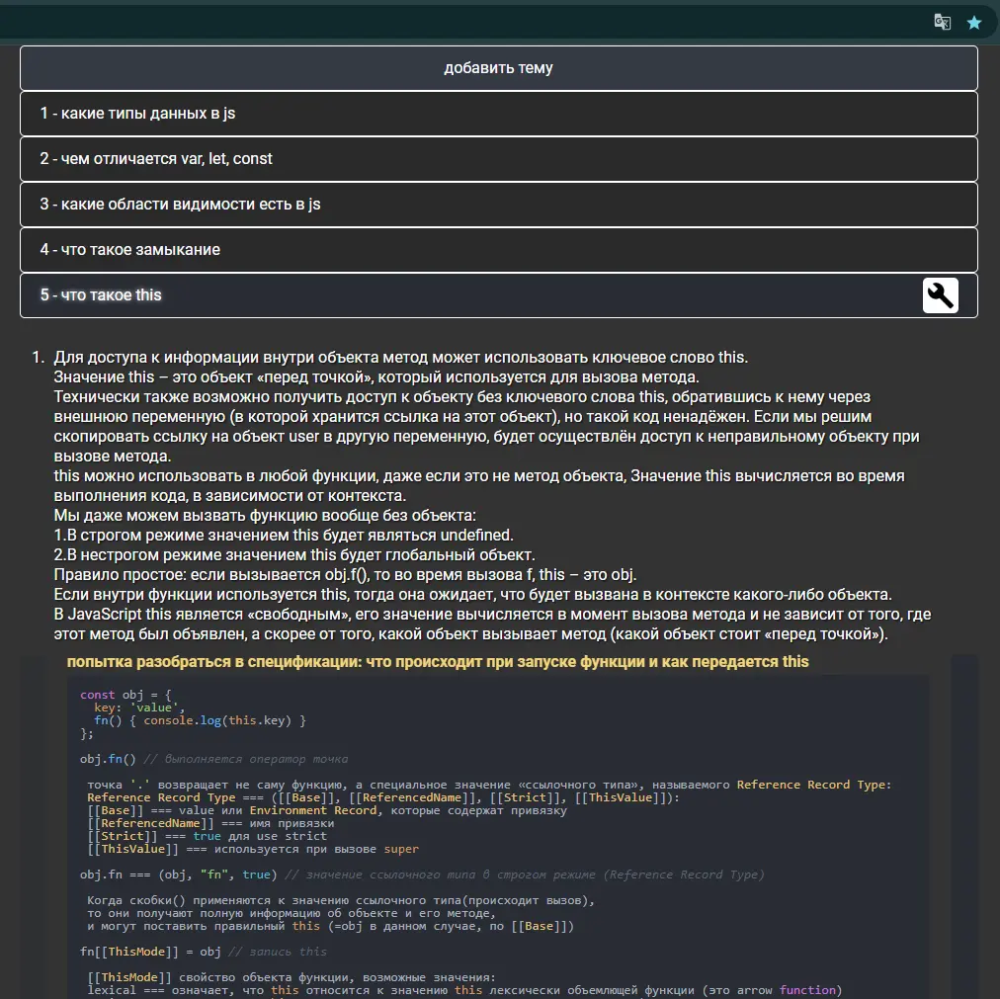

# Podcast-study (web-page)

### Video preview:

### Website:
https://podcast-study-proj.firebaseapp.com/

### Description:
A large summary on various topics in javascript with the ability to edit, add, delete topics, with code examples, images, links to sources.

### Resources used:
- https://firebase.google.com
- firebase -> Realtime Database
